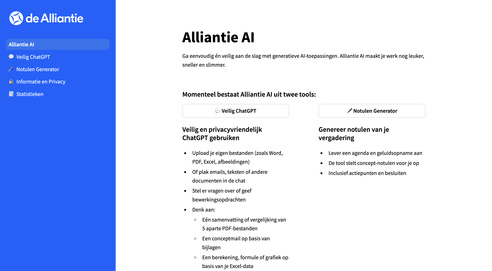
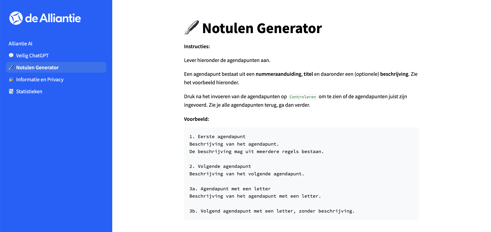

# Alliantie AI

Alliantie AI is een webapp die fungeert als een kapstok voor verschillende subapps. Op dit moment hebben we hier twee apps onder hangen: **Veilig ChatGPT** en een **Notulen Generator**.



# Veilig ChatGPT

Veilig ChatGPT is een applicatie die het mogelijk maakt om op een veilige manier ChatGPT te gebruiken, zonder kans op datalekken. Dit wordt mogelijk gemaakt door een versie van ChatGPT in onze eigen servers te draaien, waardoor er geen gevoelige informatie kan weglekken.

## Mogelijkheden
Je kan alle acties uitvoeren (chatten, documenten uploaden, data analyse, ...) die je met de reguliere ChatGPT ook kan, behalve web search. Web search staat uit om datalekken te voorkomen.


## Componenten
In de basis bestaat de applicatie uit de volgende componten:
- **[Streamlit](https://streamlit.io/) webapp:**
	- Frontend voor de eindgebruiker
	- Stuurt prompts naar de LLM
	- Laat het antwoord van de LLM zien
	- Verzorgt het uploaden van bestanden
- **Een Large-Language-Model (LLM) deployment binnen [Azure AI Foundry](https://ai.azure.com):**
	- Geeft direct antwoord op prompts zonder verdere context
	- Analyseert afbeeldingen
	- Maakt vectorstores aan voor geuploade bestanden om hier vervolgens relevante informatie uit te halen
	- Faciliteert een code-interpreter omgeving waarin code gescreven en uitgevoerd kan worden door de LLM
- **De [OpenAI responses API](https://platform.openai.com/docs/api-reference/responses)**:
	- Verzorgt communicatie tussen de Streamlit webapp en de LLM op Azure AI Foundry

## ChatGPT versies
De gebruiker kan zelf kiezen welke versie van ChatGPT gebruikt wordt. Hier kan een afweging gemaakt worden tussen snelheid, kwaliteit van het antwoord en gebruikskosten.

Momenteel ondersteunt Veilig ChatGPT de volgende versies:
- GPT-4.1 mini
- GPT-4.1
- GPT-5


## Van vraag naar antwoord
Wanneer een eindgebruiker een vraag stelt, gebeurt er het volgende:

1. In de webapp wordt er gecontroleerd of de gebruiker bestanden heeft geupload, zo ja worden deze klaargezet.
2. Er wordt een conversation aangemaakt via de Responses API, eventuele bestanden worden toegevoegd.
3. De LLM genereert een antwoord, eventueel gebruikmakende van `file_search`, `input_image`, `code_interpreter` of `reasoning`.
4. Het antwoord van de LLM wordt streamend weergegeven in de webapp.
5. Wanneer het hele antwoord gegeven is, wordt deze in zijn totaliteit weergegeven. Eventuele gegenereerde afbeeldingen en bestanden worden weergegeven en aangeboden als download. Ook worden annotaties weergegeven.


## Local development

*Note: this is the local development setup for running **only** Veilig ChatGPT. If you want to run the whole webapp, make sure to follow the instructions for the Notulen Generator as well*

### Setup
```bash
conda create -n chat python=3.10 -y && conda activate chat
pip install -r requirements-webapp.txt
```
It is recommended to run with the "streamlit debug" VSCode debug configuration, located at `.vscode/launch.json`.


# Notulen Generator
Notulen Generator is an application which automatically generates meeting notes based on a recording and the agenda of the meeting. The first version was developed for Alliantie VvE diensten, but was later generalized to accomodate the full organization.

In summary, it works as follows:
- User supplies the agenda points and a recording of the meeting
- The tool uses speech-to-text to convert the recording into a text transcript
- Relevant parts of the transcript are extracted on a per-agenda-point basis.
- For each agenda point, the relevant text is supplied to an LLM which is then tasked with generating the meeting notes for that specific agenda point.
- The responses from the LLM-calls are concatenated to create the full meeting notes.
- The meeting notes are emailed to the user.





## Full process overview

1. User uploads a recording file in the frontend. This is done with a custom component in Streamlit, so that we can bypass the webapp container and send the file directly to Azure. The user also fills in the agenda inside a text field. The user presses *Start genereren*.
2. The recording (as audio or video file) and agenda are uploaded to our Data Lake. The agenda text is uploaded as a Markdown file and the parsed agenda is uploaded as a JSON file (split by agenda item). More precisely the files are uploaded into the STORAGE_ACCOUNT_PRD storage account, in the **ds-files** blob container. Here the files are placed in the `alliantie_notulen/timestamp` folder.
3. The webapp starts the **notulen** Azure Machine Learning pipeline, passing as input the path to the folder on the data lake described in step 2. The progress of the pipeline case be observed by navigating going to Azure Machine Learning and clicking **Pipelines** in the left sidebar.
4. The *Transcribe* job of the pipeline loads the recording file from the datalake, and runs the *faster-whisper* model to create a transcript. The `transcript.txt` is placed in the data lake folder
5. The *Post-transcribe* job consists of two parts:
	1. First the `transcript.txt` is split into sections according to the uploaded *agenda*. This is done by sending multiple prompts to an Azure GPT language model (GPT-4o) (one prompt per 4 agenda items). The prompt template is located at `prompt_splitsen.md` or `prompt_splitsen_vve.md`, depending on whether we generate for a VvE.
	2. Now for each *agenda* section, the corresponding transcript is sent to the Azure ChatGPT instance, along with the agenda section, and instructions on how to create the Notulen for that section. The prompts are called [`prompt_notulen_stukje_kort.md`,`prompt_notulen_stukje_uitgebreid.md`, `prompt_notulen_stukje_kort_vve.md`, `prompt_notulen_stukje_uitgebreid_vve.md`], depending on the user's choice of generating for a VvE and how long the notes should be. Once all the notulen per agenda section have been generated, they are concatenated and put into the `result/notulen.docx` file. Finally, this `notulen.docx` is saved in the `timestamp/result` folder on the Data Lake, and sent by email to the user.


## Local development

### Setup
In order to start developing, follow these steps.

Make sure you are logged in to the Azure CLI, as this is required to authenticate. You can login using:
```bash
az login
```

Create a conda environment with necessary requirements.
```bash
conda env create -f src/notulen/azure_infra/post_transcribe_job/conda-post-transcribe.yaml -n genai && conda activate genai
pip install azure-keyvault-secrets==4.9.0
pip install -e .
pre-commit install
```
If you also want to transcribe locally, install these requirements:
```bash
conda env update -n genai -f src/notulen/azure_infra/transcribe_job/conda-transcribe.yaml
```

If you want to run the post-transcribe part of the pipeline locally, you need to have Pandoc installed. Instructions on how to install are [here](https://pandoc.org/installing.html#linux). In short: 
```bash
sudo dpkg -i pandoc-3.1.12.3-1-amd64.deb 
```
(download .deb file first, find it on datalake dev).

### Running the webapp
In order to run the webapp locally, run `2_🖋️_Notulen_Generator.py` with the `streamlit debug` debug configuration.

### Debugging the `upload_component`
To debug the Streamlit custom component for uploading files from the client-side do the following. All the front-end related content is inside `webapp_src/upload_component`.

1. Navigate to `webapp_src/upload_component/frontend`
```bash
cd webapp_src/upload_component/frontend
```

2. Install all required Node modules
```bash
npm install
```

3. Start the dev server
```bash
npm start
```
Set `RELEASE=False` inside `webapp_src/upload_component/__init__.py`. If you now run `2_🖋️_Notulen_Generator.py`, the component will be loaded from the running dev server. While running this Python file, you can edit `MyComponent.tsx` and you will directly see its effects in the webapp.

## Azure setup

Multiple things had to be setup in order to run the application on Azure.

### Datastore
In order to access the Data Lake Storage from the Azure Machine Learning Pipeline, a datastore has to be created. This can be done programatically using the `create_datastore.py` file. Note that in the file we create two datastores, one for dev and one for prd.

Once created, you can access a file using:
```python
from azure.ai.ml import Input

Input(path=f"azureml://datastores/{datastorename}/paths/{path_inside_ds_files}", type="uri_file", mode="ro_mount")
```

### Azure App Service
The App Service can be created using the portal. Then, you can run the `azure-pipelines-webapp.yml` pipeline in Azure Devops.

Furthermore, we have setup authentication with Microsoft Entra ID: makes sure that only specific people can access the webapp.

Furthermore, the App Service requires the following permissions:
1. *Read/Write* permissions on the STORAGE_ACCOUNT_PRD storage account, for the **ds-files** blob storage.
2. *Contributor* rights to the WORKSPACE_NAME_PRD Azure Machine Learning Workspace, in order to start the pipelines.
3. *AcrPull* rights tot the PRD container registry, using the system-assigned identites of all slots (acc/tst/stg/prd).

### Pipeline
The sourcecode for the pipeline job steps are in `src/notulen/azure-infra/notulen_pipeline.py`, and the `src/notulen/azure-infra/transcribe_job` and `src/notulen/azure-infra/post_transcribe` folders.


## Webapp Deployment
1. On Azure DevOps, run the `azure-pipelines-webapp.yml` pipeline.
2. On the **notulen** Azure App Service, navigate to **Deployment -> Deployment slots**. Swap the *notulen* and *notulen-stg* slot.

Do not forget to run `npm run build` and commit the build files so that the custom Streamlit component is up to date, if you made edits inside the `upload_component` folder. [See below](#streamlit-custom-component).


## Application Components
The application consists of the following components:
- Webapp (Azure App Service)
- Streamlit Custom Component for uploading files
- Datxa Lake Storage
- Azure Machine Learning Pipeline
- HTTP request to send notulen via email

### Webapp (Azure App Service)
The Webapp serves as the interface for the user to start the notulen generation process. Here the user uploads the recording and enters the agenda text.

### Streamlit Custom Component
When deploying the webapp on Azure App Services, we cannot run a dev server [as described above](#debugging-the-upload_component). Instead, we need to do `npm run build` and commit the build files inside `webapp_src/upload_component/frontend/build` in the git repository. The file that contains the code for what the component does is `MyComponent.tsx`. [See also Confluence](https://dealliantie.atlassian.net/wiki/spaces/DTD/pages/4123590667/Notuleerapp#Overdracht-van-bestanden).

The custom component code runs inside the browser (Javascript) on the client's device (client-side), while the Streamlit code runs server-side. But there is a bridge between the two sides so that information/data passes both ways. This bridge is constructed using the Python function `blob_storage_upload_component`. The arguments of this function flow inside the component towards the client, and when we use `st.session_state` variables to pass as arguments of the function, and the values of these variables change, then the change is directly noticeable for the client, without even needing a script rerun in Streamlit. The output of this function is data that flows from the client-side to the server-side, so that Streamlit can pick it up. We use `Streamlit.setComponentValue` inside the file `MyComponent.tsx` to change this data that becomes the output of `blob_storage_upload_component`. We need a script rerun (an interaction with the webapp) to pick up this updated data.

We use Shared Access Signature (SAS) tokens (1 token per file) to authenticate to the storage account. The tokens are generated in the Streamlit app and passed to the custom component. The custom component can then upload the files using an HTTP request with the SAS token. To allow HTTP requests on the storage account, we need to add a CORS rules. To add this rule, you navigate to Settings → Resource sharing (CORS), add a CORS rule, and whitelist the webapp there.

### Data Lake Storage
The Data Lake Storage is used to hold the files required for the notulen generation process. It is accessed by both the Webapp and the Azure Machine Learning Pipeline.

### Azure Machine Learning Pipeline
The Azure Machine Learning Pipeline is where the actual notulen generation happens. It consists of two parts (or jobs):
1. Transcribe
2. Post-transcribe

Because the transcribe part requires a GPU due to it's computationally heavy process, the pipeline is split up into two jobs. The transcribe job uses a machine with a GPU, the post-transcribe job uses a machine with only a CPU. This keeps cost down by only using a GPU when required, and using a low-cost CPU job for everything that happens after transcription.

We chose to go for Azure Machine Learning's serverless option, as this removes the need to setup a GPU and CPU cluster, and allows you to run as many pipelines concurrently as needed. However, it remains relatively easy to switch back to our own dedicated cluster. For this, simply set for example `cpu_node.compute = "CPU_CLUSTER_NAME"` and do not set `cpu_node.resources`

The code that is run on the CPU node is probably only `post_transcribe_component_file.py` (and similarly the `transcribe_component_file.py` on the GPU node). In that file, we start by adding the `src` folder to `sys.path` as an alternative to `pip install -e .`
For the CPU node we use a custom docker base image that we registered at ACR, which is an AzureML base image + pandoc. This, plus the Python packages specified in the corresponding `.yaml` file, becomes the "environment" that the compute node operates in. These environments are saved in AzureML workspace and don't need to be built each time.

It is easiest to always use `Input(type='uri_folder')` (or Output) instead of uri files.

In the pipeline we setup the "identiy configuration" so that the compute nodes each know how to authenticate to Azure. The compute nodes take on the user assigned managed identity of our AML workspace.
 
#### 1. Transcribe
The transcribe part of the pipeline takes a file containing an audio track and transcribes it, effectively converting it into text. The transcribe part uses OpenAI's `faster-whisper` model to transcribe the audio. 
#### 2. Post-transcribe
The post-transcribe part uses the transcript generated in part 1, and the uploaded agenda. First, the transcript is split up by agenda point, by sending a prompt to an Azure OpenAI instance of GPT. Currently we are using the `gpt-4o` model.

After the transcript is split up, we send another prompt for each agenda point to the GPT model, asking to generate the notulen based on the transcript and the original agenda part. The responses are collected and merged into a final document.

### Sending the notulen
We send the notulen to the user through mail, using a Power Automate flow see Confluence (Data Science / Werkwijze / Tips & Tricks / Automatisch emails versturen).

## Retrieving usage statistics
To retrieve usage statistics (questions, sessions, users), make sure you have the `requirements-usage-statistics.txt` installed and run the `retrieve_usage_statistics()` function:

```bash
python src/shared/utils.py
```

This will print the usage statistics in the terminal and create a `usage_statistics_{TIMESTAMP}.csv` file.